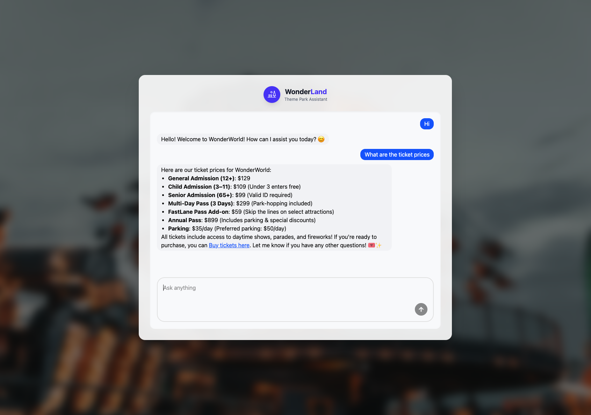

# WonderWorld AI Chatbot

> An AI-powered conversational assistant built for a theme park experience.

WonderWorld is a full-stack chatbot application that helps park visitors get instant answers about rides, attractions, tickets, food, events, and facilities — all through natural language conversation. The backend is powered by the OpenAI API with a custom prompt layer tuned specifically for theme park context, while the frontend delivers a polished, responsive chat interface.



---

## Table of Contents

- [Features](#features)
- [Tech Stack](#tech-stack)
- [Project Structure](#project-structure)
- [Getting Started](#getting-started)
- [Environment Variables](#environment-variables)
- [Development URLs](#development-urls)
- [License](#license)

---

## Features

- **Domain-specific AI** — Custom system prompt tailored to WonderWorld's rides, timings, ticketing, and facilities, keeping responses relevant and on-brand.
- **Real-time responses** — Streamed replies from the OpenAI API for a fast, natural chat experience.
- **Ride & attraction info** — Visitors can ask about wait times, height requirements, and ride descriptions.
- **Ticket & pricing guidance** — Handles common questions about admission, passes, and group bookings.
- **Food, events & facilities** — Answers queries about dining options, scheduled events, and park amenities.
- **Secure key management** — API credentials are handled server-side only and never exposed to the client.
- **Monorepo architecture** — Clean separation between client and server packages with shared tooling.

---

## Tech Stack

| Layer    | Technology        | Role                            |
| -------- | ----------------- | ------------------------------- |
| Frontend | React             | UI component framework          |
| Frontend | Tailwind CSS      | Utility-first styling           |
| Frontend | shadcn/ui         | Accessible UI component library |
| Backend  | Node.js + Express | REST API server                 |
| Backend  | OpenAI API        | Language model inference        |
| Tooling  | Bun               | Runtime and package manager     |

---

## Project Structure

```
root/
├── packages/
│   ├── client/                 # React frontend
│   │   ├── src/
│   │   │   ├── components/     # Reusable UI components
│   │   │   ├── App.tsx
│   │   │   └── main.tsx
│   │   └── package.json
│   │
│   └── server/                 # Express backend
│       ├── src/
│       │   ├── controllers/    # Request handlers
│       │   ├── prompts/        # System prompt definitions
│       │   ├── repositories/   # Data access layer
│       │   └── services/       # Business logic
│       ├── routes.ts
│       ├── index.ts
│       └── package.json
│
└── README.md
```

---

## Getting Started

### Prerequisites

- [Bun](https://bun.sh/) v1.0 or higher
- An [OpenAI API key](https://platform.openai.com/api-keys)

### Installation

Clone the repository and install all dependencies:

```sh
git clone https://github.com/Shaz-gill/fullstack-ts-chatbot.git
cd fullstack-ts-chatbot

# Install root dependencies
bun install

# Install client dependencies
cd packages/client
bun install
bun add -D tailwindcss @tailwindcss/vite

# Install server dependencies
cd ../server
bun install

# Return to project root
cd ../../
```

### Running the App

Before starting, make sure you have configured your environment variables (see below).

```sh
bun run dev
```

This starts both the client and server concurrently in development mode.

---

## Environment Variables

Create a `.env` file inside `packages/server/` with the following:

```env
OPENAI_API_KEY=your_openai_api_key_here
```

> Never commit `.env` files to version control. The `.gitignore` should exclude them by default.

---

## Development URLs

| Service  | URL                   |
| -------- | --------------------- |
| Frontend | http://localhost:5173 |
| Backend  | http://localhost:3000 |

---

## License

This project is licensed under the [MIT License](LICENSE).
